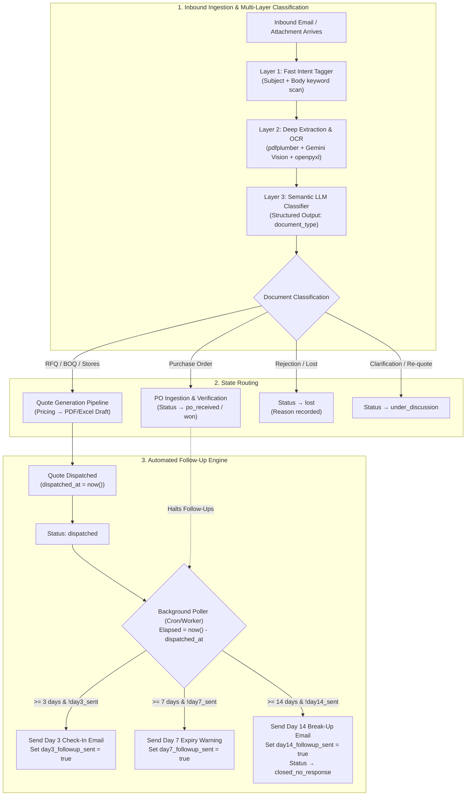
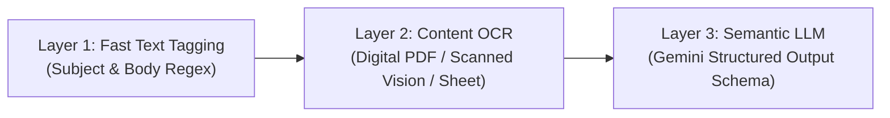

# Technical Architecture: PO Classification & Automated Follow-Up Sequences

This document outlines the technical design, data structures, and execution workflows for **Inbound Purchase Order (PO) Classification** and **Automated Quote Follow-Up Sequences** within the RFQ Automation Platform.

---

## 1. End-to-End System Architecture



---

## 2. Multi-Layered PO Classification Pipeline

Document and PO classification does not rely solely on file names. A 3-layer progressive classification model ensures zero false triggers while maintaining high processing throughput:



### Layer 1: Fast Email Text Tagging (`gmail_inbox.py`)
* **Location**: [`services/gmail_inbox.py`](file:///d:/innovizeai/code-sapien/demos/workflow-demos/rfq-agent/backend/services/gmail_inbox.py)
* **Purpose**: Immediate pre-filtering of obvious email intent before running expensive OCR operations.
* **Mechanism**:
  ```python
  def _tag_email(subject: str, body: str) -> str:
      text = (subject + " " + body).lower()
      if any(w in text for w in ["order confirmation", "purchase order", "po #", "order #"]):
          return "Order"
      if any(w in text for w in ["rfq", "request for quotation", "quotation request", "inquiry", "quote request"]):
          return "RFQ"
      if any(w in text for w in ["follow up", "follow-up", "reminder", "any update"]):
          return "Follow-up"
      if any(w in text for w in ["complaint", "issue", "problem", "damaged", "wrong item"]):
          return "Complaint"
      return "General"
  ```

### Layer 2: Deep Extraction & OCR (`email_watcher.py` & `vision_extractor.py`)
* **Location**: [`services/email_watcher.py`](file:///d:/innovizeai/code-sapien/demos/workflow-demos/rfq-agent/backend/services/email_watcher.py), [`services/vision_extractor.py`](file:///d:/innovizeai/code-sapien/demos/workflow-demos/rfq-agent/backend/services/vision_extractor.py)
* **Purpose**: Extract full text from generic or obfuscated attachment file names (e.g., `Scan_00129.pdf`, `Doc.pdf`, `Attachment_1.xlsx`).
* **Handling by Format**:
  1. **Digital PDFs**: Extracted using `pdfplumber`.
  2. **Scanned / Image PDFs**: Extracted using **Gemini Vision OCR** directly on the raw file bytes.
  3. **Spreadsheets (`.xlsx`, `.csv`)**: Parsed via `openpyxl` across all sheets.

### Layer 3: Semantic LLM Classification (`agents/parser.py`)
* **Location**: [`agents/parser.py`](file:///d:/innovizeai/code-sapien/demos/workflow-demos/rfq-agent/backend/agents/parser.py), [`models/structured_output.py`](file:///d:/innovizeai/code-sapien/demos/workflow-demos/rfq-agent/backend/models/structured_output.py)
* **Purpose**: Structural understanding of document semantics using Gemini Structured Output.
* **Schema Definition**:
  ```python
  class ParsedRFQ(BaseModel):
      document_type: str = Field(
          "RFQ",
          description=(
              "Type of document received. Choose the best match: "
              "'RFQ' (standard request for quotation, plain email or text), "
              "'BOQ' (Bill of Quantities — structured list with item refs, categories, project codes), "
              "'Lane Bid' (freight lane bid sheet — origin/destination/equipment columns), "
              "'Stores Requisition' (ship chandler list — IMPA/ISSA codes, vessel name, port), "
              "'Purchase Order' (buyer is placing an order, not requesting a quote), "
              "'Invoice' (billing document from supplier), "
              "'Unknown' (cannot determine)."
          ),
      )
  ```
* **Structural Markers Distinguishing a Purchase Order from an RFQ**:
  * **Binding Commitment Language**: *"Please supply the following items as per Quote #..."*, *"Authorized Purchase Order"*, *"Billing to..."*
  * **Commercial Metadata**: Buyer PO number, Order Date, Payment Terms (e.g., *Net 30*, *CIF Dubai*), Delivery Site contact.
  * **Signatures & Stamps**: Authorized procurement signature blocks or corporate seals.

---

## 3. Automated Follow-Up Sequences & State Engine

When a quote is dispatched, the system enters an automated follow-up cadence that tracks elapsed days from `dispatched_at`.

### Database State Tracking (`rfq_submissions`)
The `rfq.rfq_submissions` table tracks dispatch time and sequence state:

```sql
ALTER TABLE rfq.rfq_submissions 
ADD COLUMN IF NOT EXISTS dispatched_at TIMESTAMP WITH TIME ZONE,
ADD COLUMN IF NOT EXISTS day3_followup_sent BOOLEAN DEFAULT FALSE,
ADD COLUMN IF NOT EXISTS day7_followup_sent BOOLEAN DEFAULT FALSE,
ADD COLUMN IF NOT EXISTS day14_followup_sent BOOLEAN DEFAULT FALSE;
```

### Follow-Up Sequence Schedule & Email Templates

All follow-up emails are dispatched directly in the original email thread (`In-Reply-To` and `References` headers) to preserve conversation context for the buyer.

| Timing | Condition | Subject Line | Script Template |
| :--- | :--- | :--- | :--- |
| **Day 0** | Immediate upon Approval | `Quotation {rfq_id} — {Subject}` | Branded PDF quotation + filled Excel pricing template attachment. |
| **Day 3** | `elapsed >= 3 days`<br>`!day3_sent` | `Re: Quotation {rfq_id}` | *"Hi {buyer_name},<br><br>Just following up on the quotation sent across on {dispatched_date}. Wanted to check if you had a chance to review it and if you have any questions regarding pricing or delivery timelines.<br><br>Happy to adjust quantities if needed.<br><br>Best regards,"* |
| **Day 7** | `elapsed >= 7 days`<br>`!day7_sent` | `Re: Quotation {rfq_id} — Valid Until {expiry_date}` | *"Hi {buyer_name},<br><br>The quote for {category} is valid until {expiry_date}. If you are still evaluating suppliers, I am happy to offer a short extension or discuss any adjustments.<br><br>Please let me know if you would like to proceed.<br><br>Best regards,"* |
| **Day 14** | `elapsed >= 14 days`<br>`!day14_sent` | `Closing Inquiry — {rfq_id}` | *"Hi {buyer_name},<br><br>I will close this inquiry on my end. If requirements come back around or you need a revised quote in the future, please feel free to reach out.<br><br>Best regards,"*<br>*(Status updated to `closed_no_response`)* |

---

## 4. PO Receipt & Halting Mechanics

When the customer replies with an order confirmation or PO:

1. **Thread / RFQ Match**: The incoming email is matched to the active quote record via `thread_id` or `rfq_id` extracted from the subject line.
2. **Intent Classification**: The email and PO attachment are classified as `document_type = "Purchase Order"`.
3. **Halting Trigger**:
   * The database record status updates:
     ```python
     await db.execute(
         update(RFQSubmission)
         .where(RFQSubmission.rfq_id == matched_rfq_id)
         .values(status="po_received")
     )
     ```
   * Because the status transitions out of `"dispatched"`, the background follow-up poller immediately skips the record on all subsequent intervals.
4. **PO Extraction**:
   * PO Number, PO Total, delivery date, and payment terms are extracted and linked directly to the original quote for invoice matching.

---

## 5. File & Component Reference Map

| Component | File Path | Responsibility |
| :--- | :--- | :--- |
| **Database Model** | [`backend/db/models.py`](file:///d:/innovizeai/code-sapien/demos/workflow-demos/rfq-agent/backend/db/models.py) | Stores `dispatched_at`, `status`, and `day3/7/14_followup_sent` flags. |
| **Pydantic Schemas** | [`backend/models/structured_output.py`](file:///d:/innovizeai/code-sapien/demos/workflow-demos/rfq-agent/backend/models/structured_output.py) | Defines `ParsedRFQ.document_type` classification schema. |
| **Parser Node** | [`backend/agents/parser.py`](file:///d:/innovizeai/code-sapien/demos/workflow-demos/rfq-agent/backend/agents/parser.py) | Invokes Gemini LLM with structured output to classify document type. |
| **Inbox Reader** | [`backend/services/gmail_inbox.py`](file:///d:/innovizeai/code-sapien/demos/workflow-demos/rfq-agent/backend/services/gmail_inbox.py) | Fast intent tagger (`_tag_email`) on subject and email body. |
| **Email Watcher** | [`backend/services/email_watcher.py`](file:///d:/innovizeai/code-sapien/demos/workflow-demos/rfq-agent/backend/services/email_watcher.py) | Background poller for inbound Gmail messages and attachment OCR. |
| **Quote Approval** | [`backend/routes/rfq.py`](file:///d:/innovizeai/code-sapien/demos/workflow-demos/rfq-agent/backend/routes/rfq.py) | Stamps `dispatched_at = func.now()` on quote approval. |
| **Follow-Up Service** | [`backend/services/followup_service.py`](file:///d:/innovizeai/code-sapien/demos/workflow-demos/rfq-agent/backend/services/followup_service.py) | Background scheduler evaluating elapsed days and dispatching follow-ups. |
